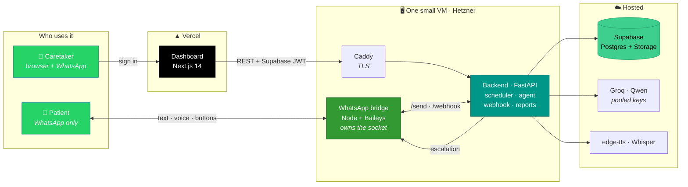
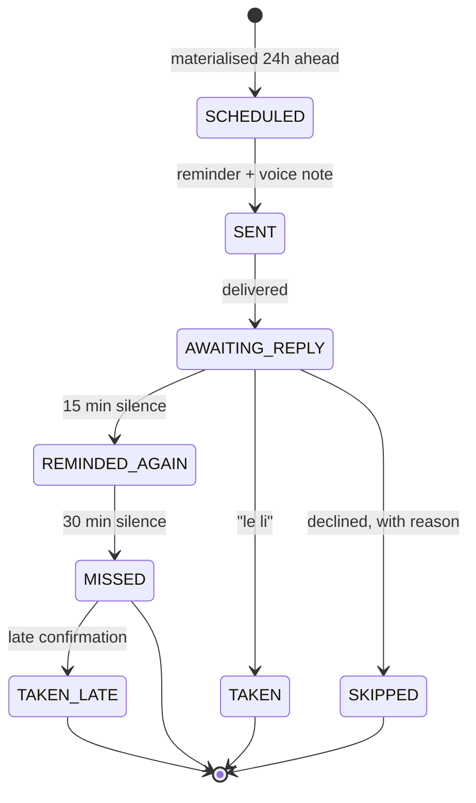
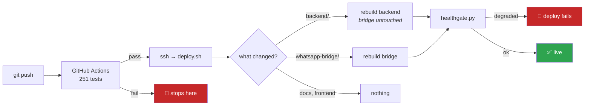

<div align="center">

# 💊 MedNuskha

### An AI care agent that keeps elderly patients on their medication — entirely over WhatsApp

**The patient installs nothing. Learns nothing. Just answers a message.**

<br>

[](https://api.mednuskha.site/api/health)
[](backend/tests)
[](.github/workflows/deploy.yml)


</div>

---

A caretaker signs up on the website and adds a family member and their
medicines. The patient gets a WhatsApp reminder at every dose, with an Urdu
voice note. They reply however they like — typed or spoken, Urdu script, Roman
Urdu or English — and the agent understands it. Silence escalates to the
caretaker. When a course ends, two PDFs are generated: a clinical one for the
doctor and a plain-language one for the family.

<div align="center">

### What it actually looks like

</div>

```
 08:00  ⏰  "Ammi ji, 8 baj gaye — Panadol 500mg lene ka waqt hai.
             Khane ke baad lein."                        🔊 + voice note

 08:04  💬  "le li"

 08:04  ✅  "Shukriya Ammi ji. Panadol 500mg le li — likh liya hai."


 20:00  ⏰  reminder                                  → no answer
 20:15  🔔  gentle follow-up                          → no answer
 20:30  📲  Usman gets: "Ammi ne aaj 8 baje ki Panadol 500mg
             confirm nahi ki. Do baar yaad dilaya gaya hai."
```

---

## 🩺 What makes it different

<table>
<tr>
<td width="50%" valign="top">

**It meets people where they are**

No app. No login. No new habit. A 68-year-old who already uses WhatsApp to see
her grandchildren gets a message and answers it — by voice if reading is hard.

**It speaks the language people actually type**

Urdu script, Roman Urdu, English, or a mix, with the spelling people really
use. `"Lely Mene"` and `"Layli mainay"` both mean *"I took it"*, and both work.

</td>
<td width="50%" valign="top">

**It refuses to guess about medicine**

There is no code path from a patient's question to a live model call about a
drug. The agent repeats only what a caretaker has confirmed, and says it does
not know otherwise.

**It knows what it does not know**

Two medicines pending and an unclear reply? It asks which — naming both —
rather than picking one and recording a dose nobody took.

</td>
</tr>
</table>

---

## 🏗 Architecture



**Three processes and one hosted database.**

| Process | Port | What it is |
|---|:---:|---|
| 🖥 **Dashboard** | 3000 | Next.js 14 — the caretaker's website → Vercel |
| ⚙️ **Backend** | 8000 | FastAPI — API, scheduler, agent, webhook, reports |
| 💬 **WhatsApp bridge** | 3001 | Node + Baileys — owns the WhatsApp socket |
| 🗄 **Supabase** | — | Postgres 17 (11 tables) + Storage, hosted |

The bridge exists because Baileys is Node-only and the backend is Python. It is
deliberately dumb — no business logic, no database — so swapping WhatsApp
providers touches two files, not the system.

<details>
<summary><b>How a dose actually flows through it</b></summary>

<br>



`scheduler/state_machine.py` is the **only** module allowed to mutate
`dose_event.state`. Every transition is guarded — an illegal move is refused
and logged rather than silently applied, which is what stops a late webhook
retry dragging a `TAKEN` dose back into `REMINDED_AGAIN`.

</details>

---

## 📋 Prerequisites

- **Python 3.11+** (developed on 3.14; the container is 3.11)
- **Node 20+**
- **A Supabase project** — free tier is plenty
- **A phone with WhatsApp** to pair the bridge to, once
- No Docker needed for development. No ffmpeg, no GTK — see *Why there are no
  system dependencies* below.

---

## ⚡ Setup

### 1. Clone and install

```bash
git clone https://github.com/abzakir/MedNuskha.git
cd MedNuskha
make install          # or: .\install.ps1 on Windows
```

That creates `backend/.venv`, installs the Python requirements, and runs
`npm install` in `frontend/`.

### 2. Configure

```bash
cp .env.example .env
```

`.env.example` documents every variable, what it is for, and where to get it.
The ones you cannot start without:

| Variable | Where it comes from |
|---|---|
| `DATABASE_URL` | Supabase → Project Settings → Database → Connection string (**session pooler**) |
| `SUPABASE_URL`, `SUPABASE_ANON_KEY` | Supabase → Project Settings → API keys |
| `GROQ_API_KEY` | console.groq.com — free. Comma-separate several to widen the pool |
| `WEBHOOK_SECRET` | Invent one. Any long random string |

Worth setting, but not blocking:

| Variable | Why |
|---|---|
| `SUPABASE_SERVICE_KEY` | The `sb_secret_` key. Without it nothing is archived to Storage — reports are rebuilt on each open and voice notes are re-synthesised after each deploy. Both still work. |
| `ALLOWED_NUMBERS` | The bridge will message **anyone** when this is empty. Set it on any deployed instance. |
| `DEV_AUTH_BYPASS` | `true` locally treats unauthenticated requests as a fixed caretaker. **Must be `false` in production.** |

Nothing else needs an account: `edge-tts` reaches Microsoft's neural voices
with no key, and `faster-whisper` runs locally.

### 3. Pair WhatsApp, once

```bash
make bridge           # or: .\bridge.ps1
```

Scan the QR code from the phone that owns the number. The session is written to
`whatsapp-bridge/auth_info/`, which is gitignored and **is a real WhatsApp
login** — anyone holding that folder can read the account's messages. Never
commit it, never share it.

### 4. Run everything

```bash
make dev              # or: .\dev.ps1  (this one also starts the bridge)
```

- Dashboard — http://localhost:3000
- Health — http://localhost:8000/api/health

`/api/health` reports the database, the scheduler, the WhatsApp connection and
how many AI keys are alive, in one call. Check it first when something is off.

### 5. Seed a demo

```bash
make seed             # or: .\seed.ps1
```

One caretaker, one patient, three real medicines and 14 days of backdated doses
with a believable mix of taken, late and missed — so the dashboard and both
PDFs have something worth showing immediately.

It attaches to whichever caretaker signed in most recently, so sign in once
first. Safe to run twice; `--purge-only` removes it again.

```bash
python scripts/seed_demo.py --phone 923001234567   # a LIVE demo: this number
                                                   # starts getting reminders
```

---

## 🧪 Tests

```bash
make test                                    # 251 unit tests, ~1.7s, no services
python scripts/preflight.py                  # is this .env fit to deploy?
python scripts/verify/verify_credentials.py  # is every key actually working?
```

**The unit suite touches nothing.** No database, no network, no WhatsApp — it
runs in under two seconds and is safe with production live. It reached live
Supabase once by accident and a "pure" test took 4.6 seconds and went red on
every network wobble; there is now a test asserting it cannot.

Most of these exist because something reached a real patient:

| File | The failure it pins |
|---|---|
| `test_ambiguity.py` | *"Yes, I have taken this"* answered *"Sorry, I didn't catch that"* — three times |
| `test_consent_gate.py` | a mistyped digit receiving somebody's medical reminders |
| `test_optin.py` | *"HAAN"* to the intro recorded as a dose swallowed |
| `test_forwarded_reply.py` | a forwarded voice note recorded as a dose taken |
| `test_voice.py` | a voice note that never said the medicine's name |
| `test_scheduler_lock.py` | two processes both sending every reminder |
| `test_materialise.py` | a medicine added at 2pm reporting its 8am dose missed |
| `test_time_label.py` | *"4 baj gaye"* announced for a 09:30 dose |

`scripts/verify/` holds ~310 integration checks against the live database,
live Groq and the live bridge. `scripts/verify/README.md` says what each covers.

---

## 🚀 Deployment

**It is already deployed.** Backend and bridge on one Hetzner CX23 in
Falkenstein behind Caddy, dashboard on Vercel, database on Supabase Frankfurt.

```
https://api.mednuskha.site/api/health   →  status ok · scheduler_lock held
```

**Full step-by-step — Hetzner (recommended) or Oracle Cloud (free) — is in
[DEPLOY.md](DEPLOY.md).**

### A push to `main` deploys itself



**A backend-only commit never restarts the bridge.** Restarting it drops the
WhatsApp socket, and every message a patient sends during the reconnect is
gone — Baileys is not a queue.

The health gate then **fails the deploy** if the database, the bridge or the
scheduler lock did not come back. A deploy that quietly leaves the API down is
worse than one that never ran, because nobody looks until a dose is missed.

### Reading `/api/health`

`scheduler: running` only means the timer is ticking. **`scheduler_lock: held`
means this is the process that actually sends.** When nothing is arriving, read
that one — the usual cause is a backend still running on somebody's laptop
against the same database.

> ⚠️ **Never run the local backend while the server is live.** It takes the
> Postgres advisory lock and the server drops to standby, sending nothing.
> Production takes it back on its own within a tick once you stop.

### Before going live

| Setting | Why it matters |
|---|---|
| `DEV_AUTH_BYPASS=false` | otherwise every unauthenticated request is a caretaker *(compose forces this)* |
| `NEXT_PUBLIC_API_BASE` | report links are built from it — left as localhost, every link a caretaker taps is dead |
| `SUPABASE_SERVICE_KEY` | without it nothing is archived; reports and voice notes are rebuilt each deploy |
| back up `whatsapp-auth` | the one piece of state that cannot be rebuilt — losing it means re-pairing by QR, with the phone in hand |

`python scripts/preflight.py` checks all of these on a bare box, no venv needed.

---

## 🧱 Why there are no system dependencies

Two deliberate choices, both of which removed an apt line and a class of
"works on my machine":

- **PDFs use fpdf2, not WeasyPrint.** WeasyPrint needs GTK and Pango, which pip
  does not ship on Windows — it could not even import on the dev machine. The
  Urdu fonts are committed to the repo rather than taken from the system, so a
  bare Ubuntu box renders exactly what was signed off.
- **Audio uses PyAV, not an ffmpeg binary.** PyAV bundles FFmpeg's libraries in
  its wheel and handles both directions — MP3 to OGG/Opus going out, decoding
  going in.

If you find yourself adding `apt install` to the Dockerfile, check whether a
dependency changed first.

---

## 🗂 Where things are

```
backend/app/
  whatsapp/      client, webhook, parser — the only modules that talk to WhatsApp
  scheduler/     ticker (every minute), state_machine (the only writer of dose state)
  agent/         interpret, respond, guardrails, knowledge, llm, caretaker
  voice/         asr (faster-whisper), tts (edge-tts), store
  reports/       data, doctor_pdf, caretaker_pdf, service, storage
  api/routes.py  REST for the dashboard
frontend/        Next.js dashboard
whatsapp-bridge/ Node + Baileys
scripts/verify/  integration checks
```

`AGENTS.md` is the specification — invariants, phase plan, conventions.
`PROJECT_LOG.md` is the running history: what was decided, what broke, and
every measurement that shaped a design. Read both before changing anything.

---

## 🛡 Safety

This is a medication reminder, not a medical device. Three rules are enforced in
code rather than by convention:

- **The agent never gives medical advice.** Guardrails run on the outbound text,
  after the model has spoken — a system prompt can be talked around, a regex
  over the final message cannot.
- **It only repeats caretaker-confirmed information.** There is no code path
  from a patient's question to a live model call about a medicine.
- **Nothing claims a dose was observed.** Every report states in full that these
  are patient-reported confirmations, not observed ingestion.
