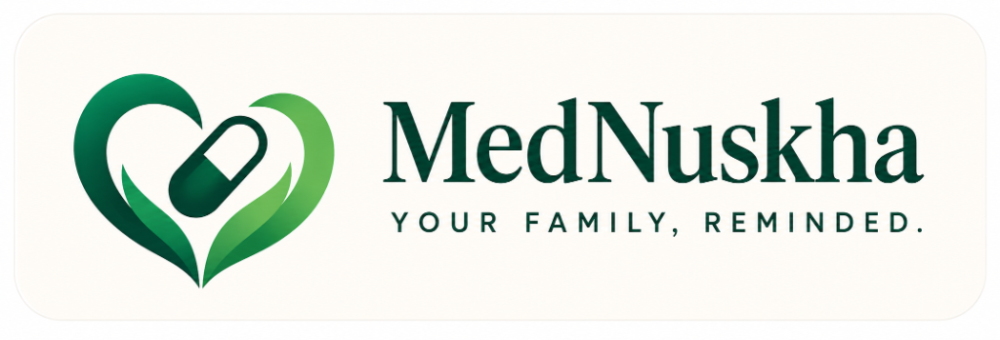

<div align="center">



<br/><br/>

# 💻 MedNuskha Frontend Dashboard

### The caretaker web interface built with Next.js 14, Tailwind CSS, and shadcn/ui.

</div>

---

## 💡 Overview

The **MedNuskha Caretaker Dashboard** is the central control center where family members and caretakers:
- Register and manage patient profiles (name, WhatsApp number, language preference, relation).
- Set up medicine schedules and custom tenures (7, 14, 30 days, or custom duration).
- Review and confirm AI-fetched medicine safety rules before activation.
- Monitor live adherence tracking, dose logs, and missed-dose timelines.
- Download generated PDF reports for doctors and family members on demand.

---

## ⚡ Getting Started

First, run the development server from this directory:

```bash
npm run dev
# or
yarn dev
# or
pnpm dev
# or
bun dev
```

Open [http://localhost:3000](http://localhost:3000) with your browser to see the dashboard.

You can start editing the page by modifying `app/page.tsx`. The page auto-updates as you edit the file.

This project uses [`next/font`](https://nextjs.org/docs/app/building-your-application/optimizing/fonts) to automatically optimize and load [Geist](https://vercel.com/font).

---

## 📚 Learn More

To learn more about Next.js, take a look at the following resources:

- [Next.js Documentation](https://nextjs.org/docs) - learn about Next.js features and API.
- [Learn Next.js](https://nextjs.org/learn) - an interactive Next.js tutorial.

---

## 🚀 Deployment

The Next.js frontend is deployed on Vercel. For deployment details, check out the [Next.js deployment documentation](https://nextjs.org/docs/app/building-your-application/deploying).

